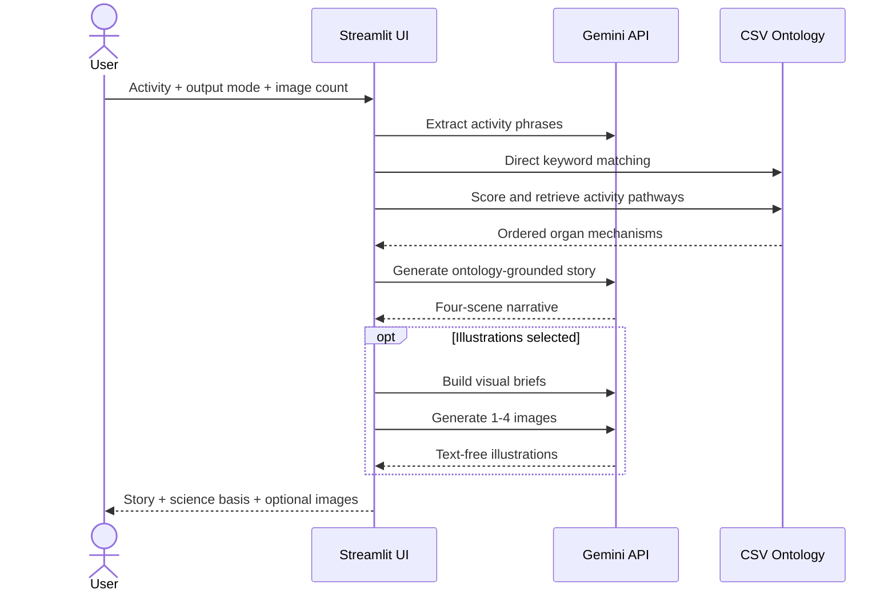

# BodyBuddies Adventures: Project Structure

This document describes the implementation of the lightweight Streamlit demo.
For the visitor-facing project overview, see [README.md](README.md).

## Repository Layout

```text
BodyBuddies-Adventure/
├── app.py
├── data/
│   └── ontology_multi_organ_steps.csv
├── .streamlit/
│   └── secrets.toml.example
├── .env.example
├── .gitignore
├── requirements.txt
├── README.md
└── PROJECT_STRUCTURE.md
```

Runtime secrets, virtual environments, Python caches, and macOS metadata are
excluded through `.gitignore`.

## Runtime Architecture



## `app.py` Responsibilities

The single-file application is intentionally small enough for a public demo while
keeping the main workflow explicit.

### Configuration

`get_config_value`, `get_int_config`, and `get_bool_config` read environment
variables first and Streamlit secrets second. Visitors never enter an API key in
the interface.

### Ontology loading

`load_ontology` loads and validates the CSV once through `st.cache_data`.

Required columns:

```text
activity, organ, mechanism, step
```

Optional retrieval metadata:

```text
superclass, class, keywords
```

The current ontology contains:

- 600 mechanism rows.
- 99 unique activities.
- 31 unique organs.

### Lightweight retrieval

The application does not use embeddings or a vector database.

1. `extract_events_gemini` extracts one to four physiology-relevant phrases.
2. `find_activity_matches` performs direct matching on the original user input.
3. `score_activity_match` scores activity names, keywords, classes, and mechanism
   token overlap.
4. `find_best_activity_steps` returns ordered rows for the strongest activity.
5. `build_multi_organ_journey` formats the selected rows as the scientific context
   for story generation.

If no ontology activity matches, the application stops before story generation
and suggests supported activities.

### Story generation

`generate_physiology_story` asks the text model to use the retrieved journey as
the scientific backbone and return exactly four sections:

```text
SCENE 1: ENTRY
SCENE 2: TRANSPORT
SCENE 3: THE MECHANISM (CLIMAX)
SCENE 4: RESOLUTION
```

The prompt requests the same primary language as the user's input and avoids
diagnosis, treatment instructions, and medical advice.

### Illustration generation

Illustrations are optional and selected before generation.

1. `build_comic_scenes_from_story` converts the finished narrative into the
   requested number of visual briefs.
2. `generate_images_from_story` sends each brief to the configured image model.
3. The image request explicitly asks for image-only output, a 16:9 aspect ratio,
   and text-free educational artwork.

The public configuration caps output at four images. Setting
`ENABLE_IMAGE_GENERATION=false` removes the image option entirely.

## API Call Profile

Story-only mode normally uses:

1. One text call for event extraction.
2. One text call for the final story.

Story plus illustrations additionally uses:

1. One text call to create the selected visual briefs.
2. One image call per requested illustration.

This matters for latency, quota, and public-demo cost controls.

## Environment Variables

| Variable | Default | Purpose |
| --- | --- | --- |
| `GEMINI_API_KEY` | Required | Server-side Gemini credential. |
| `TEXT_MODEL` | `gemini-2.5-flash` | Event extraction and story model. |
| `IMAGE_MODEL` | `gemini-3.1-flash-image` | Illustration model. |
| `IMAGE_ASPECT_RATIO` | `16:9` | Generated image ratio. |
| `IMAGE_SIZE` | `1K` | Generated image resolution. |
| `MAX_PUBLIC_IMAGES` | `4` | Maximum illustrations per request. |
| `MAX_INPUT_CHARS` | `800` | User input length limit. |
| `SESSION_GENERATION_LIMIT` | `5` | Story generations per browser session. |
| `ENABLE_IMAGE_GENERATION` | `true` | Enables illustration controls. |
| `SHOW_DEBUG_ERRORS` | `false` | Shows internal errors when enabled. |

## Secret Handling

Local development uses `.env`:

```bash
cp .env.example .env
```

Streamlit deployments can use `.streamlit/secrets.toml`. The real files are
ignored by Git and must not be committed.

The browser-session generation counter is a usability control, not a security
boundary. A public deployment should also configure provider-side API quotas,
billing alerts, and rate limiting appropriate to its expected traffic.

## Dependencies

The application uses:

- `streamlit` for the web interface.
- `google-genai` for text and image generation.
- `pandas` for CSV loading and filtering.
- `python-dotenv` for local server-side configuration.
- `pillow` for decoding generated images.

There is no Chroma, sentence-transformers, OCR pipeline, ngrok, or Colab runtime
dependency.

## Validation

Before publishing:

```bash
python3 -m py_compile app.py
```

The UI can also be checked with Streamlit's application testing API to verify:

- Story-only mode has no image slider.
- Illustration mode exposes a valid 1-4 slider.
- No server secret appears in the UI.
- Missing ontology matches stop before story generation.

## Known Limitations

- Generated health explanations may still contain model errors despite ontology
  grounding.
- Keyword retrieval is intentionally lightweight and does not provide full
  semantic matching.
- Generated illustrations are educational artwork, not anatomical diagrams.
- Public image generation can consume substantial API quota.
- The session generation limit can be reset by opening a new browser session.
