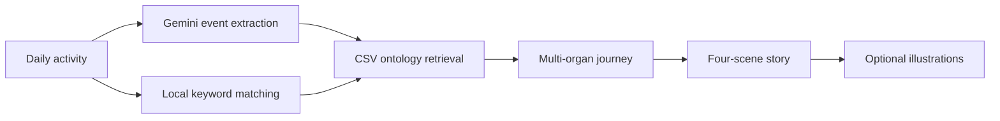

# BodyBuddies Adventures

BodyBuddies Adventures turns everyday activities into illustrated, science-grounded
stories about what happens inside the human body.

The demo combines a lightweight CSV physiology ontology with Gemini. It retrieves
relevant multi-organ mechanisms first, then uses those mechanisms as the scientific
backbone for a four-scene story. Users can generate text only or request one to four
illustrations.

> Educational demo only. The generated content is not medical advice, diagnosis,
> or treatment guidance.

## Demo Experience

### 1. Describe an everyday activity

Example:

> This morning I drank coffee on an empty stomach, had fried chicken for lunch,
> and went swimming in the afternoon.

Before generating, the user chooses:

- **Story only** for a faster, lower-cost response.
- **Story + illustrations** with a slider for one to four images.

### 2. Follow the internal body adventure

Every story follows the same four-scene structure:

| Scene | Story role |
| --- | --- |
| **Scene 1: Entry** | The activity, food, or molecule enters the body. |
| **Scene 2: Transport** | Organs, blood, cells, or signaling systems respond. |
| **Scene 3: The Mechanism** | The central physiological mechanism becomes the climax. |
| **Scene 4: Resolution** | The body adapts, restores balance, or completes the response. |

### 3. See the science behind the story

The app displays the matched CSV ontology pathway alongside the final story. This
makes it clear which organs and mechanisms grounded the generated narrative.



## Run Locally

### Prerequisites

- Python 3.11 or newer.
- Git.
- A Gemini API key created in Google AI Studio.

### 1. Clone the repository

```bash
git clone https://github.com/dyffffff/BodyBuddies-Adventure.git
cd BodyBuddies-Adventure
```

### 2. Create and activate a virtual environment

macOS or Linux:

```bash
python3 -m venv .venv
source .venv/bin/activate
```

Windows PowerShell:

```powershell
py -m venv .venv
.\.venv\Scripts\Activate.ps1
```

After activation, the terminal prompt should normally include `(.venv)`.

### 3. Install the dependencies

```bash
python -m pip install --upgrade pip
python -m pip install -r requirements.txt
```

The installation includes Streamlit, the Gemini SDK, pandas, dotenv, and Pillow.
No Chroma, sentence-transformers, Colab, or ngrok dependency is required.

### 4. Configure the server-side API key

macOS or Linux:

```bash
cp .env.example .env
```

Windows PowerShell:

```powershell
Copy-Item .env.example .env
```

Open the new `.env` file and replace the placeholder:

```dotenv
GEMINI_API_KEY=your_server_side_gemini_api_key
```

The remaining values in `.env` are optional. They control the text model, image
model, input limit, illustration count, and session generation limit. Never
commit `.env`; it is already excluded by `.gitignore`.

### 5. Start the application

```bash
python -m streamlit run app.py
```

Streamlit should open the demo automatically. If it does not, visit:

```text
http://localhost:8501
```

Enter an everyday activity, select **Story only** or
**Story + illustrations**, choose the number of images when applicable, and
click the generate button.

Press `Ctrl+C` in the terminal to stop the local server.

### Troubleshooting

- **`GEMINI_API_KEY is not configured`**: confirm `.env` exists in the repository
  root and contains a valid key without quotation marks.
- **Port 8501 is already in use**: start on another port with
  `python -m streamlit run app.py --server.port 8502`.
- **No matching physiology pathway**: try one of the activities suggested in the
  sidebar; unsupported activities intentionally stop before story generation.
- **Image generation fails**: first try **Story only** mode, then confirm that the
  configured Gemini account can access the selected image model.

## Configuration

The default configuration uses:

```text
Text model:  gemini-2.5-flash
Image model: gemini-3.1-flash-image
Image size:  1K, 16:9
Image limit: 4
```

Set deployment secrets in the hosting platform. Never commit `.env` or
`.streamlit/secrets.toml`.

## Project Documentation

See [PROJECT_STRUCTURE.md](PROJECT_STRUCTURE.md) for:

- Repository structure and component responsibilities.
- Ontology retrieval and Gemini request flow.
- Environment variables and deployment configuration.
- Public-demo limitations and security considerations.

## Core Files

| File | Purpose |
| --- | --- |
| `app.py` | Streamlit UI, ontology retrieval, story generation, and illustrations. |
| `data/ontology_multi_organ_steps.csv` | Lightweight multi-organ physiology ontology. |
| `requirements.txt` | Minimal Python dependencies. |
| `.env.example` | Local server-side configuration template. |
| `.streamlit/secrets.toml.example` | Streamlit deployment secret template. |

## License and Data Use

This repository currently does not include an explicit open-source license.
Contact the project owner before redistributing the code or ontology data.

## Demo Screenshots

### 1. Activity Input and Illustration Settings

<p align="center">
  
</p>

### 2. Generated Story

<p align="center">
  
</p>

### 3. Story Resolution and First Illustration

<p align="center">
  
</p>

### 4. Additional Story Illustration

<p align="center">
  
</p>
