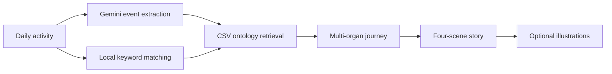

# BodyBuddies Adventures

BodyBuddies Adventures turns everyday activities into illustrated, science-grounded
stories about what happens inside the human body.

The demo combines a lightweight CSV physiology ontology with Gemini. It retrieves
relevant multi-organ mechanisms first, then uses those mechanisms as the scientific
backbone for a four-scene story. Users can generate text only or request one to four
illustrations.

> Educational demo only. The generated content is not medical advice, diagnosis,
> or treatment guidance.

## Demo Experience

### 1. Describe an everyday activity

Example:

> This morning I drank coffee on an empty stomach, had fried chicken for lunch,
> and went swimming in the afternoon.

Before generating, the user chooses:

- **Story only** for a faster, lower-cost response.
- **Story + illustrations** with a slider for one to four images.

### 2. Follow the internal body adventure

Every story follows the same four-scene structure:

| Scene | Story role |
| --- | --- |
| **Scene 1: Entry** | The activity, food, or molecule enters the body. |
| **Scene 2: Transport** | Organs, blood, cells, or signaling systems respond. |
| **Scene 3: The Mechanism** | The central physiological mechanism becomes the climax. |
| **Scene 4: Resolution** | The body adapts, restores balance, or completes the response. |

### 3. See the science behind the story

The app displays the matched CSV ontology pathway alongside the final story. This
makes it clear which organs and mechanisms grounded the generated narrative.



## Why This Version

This repository is the lightweight public-demo version of the original
Colab/ngrok prototype:

- No Colab or ngrok setup.
- No Chroma vector database.
- No sentence-transformers model download.
- No API key entry in the user interface.
- Server-side Gemini secret configuration.
- A transparent CSV ontology with 600 rows, 99 activities, and 31 organs.
- Optional illustration generation with a server-configurable limit.

## Run Locally

```bash
python3 -m venv venv
source venv/bin/activate
pip install -r requirements.txt
cp .env.example .env
```

Add your Gemini API key to `.env`:

```bash
GEMINI_API_KEY=your_server_side_gemini_api_key
```

Start the app:

```bash
streamlit run app.py
```

Then open `http://localhost:8501`.

## Configuration

The default configuration uses:

```text
Text model:  gemini-2.5-flash
Image model: gemini-3.1-flash-image
Image size:  1K, 16:9
Image limit: 4
```

Set deployment secrets in the hosting platform. Never commit `.env` or
`.streamlit/secrets.toml`.

## Project Documentation

See [PROJECT_STRUCTURE.md](PROJECT_STRUCTURE.md) for:

- Repository structure and component responsibilities.
- Ontology retrieval and Gemini request flow.
- Environment variables and deployment configuration.
- Public-demo limitations and security considerations.

## Core Files

| File | Purpose |
| --- | --- |
| `app.py` | Streamlit UI, ontology retrieval, story generation, and illustrations. |
| `data/ontology_multi_organ_steps.csv` | Lightweight multi-organ physiology ontology. |
| `requirements.txt` | Minimal Python dependencies. |
| `.env.example` | Local server-side configuration template. |
| `.streamlit/secrets.toml.example` | Streamlit deployment secret template. |

## License and Data Use

This repository currently does not include an explicit open-source license.
Contact the project owner before redistributing the code or ontology data.
