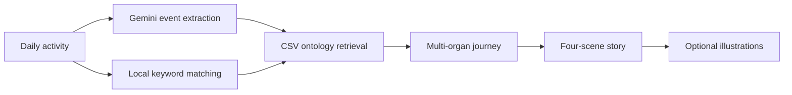
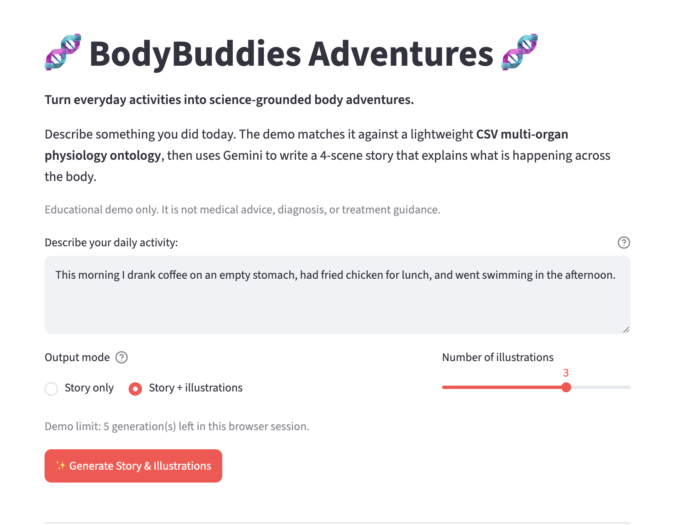
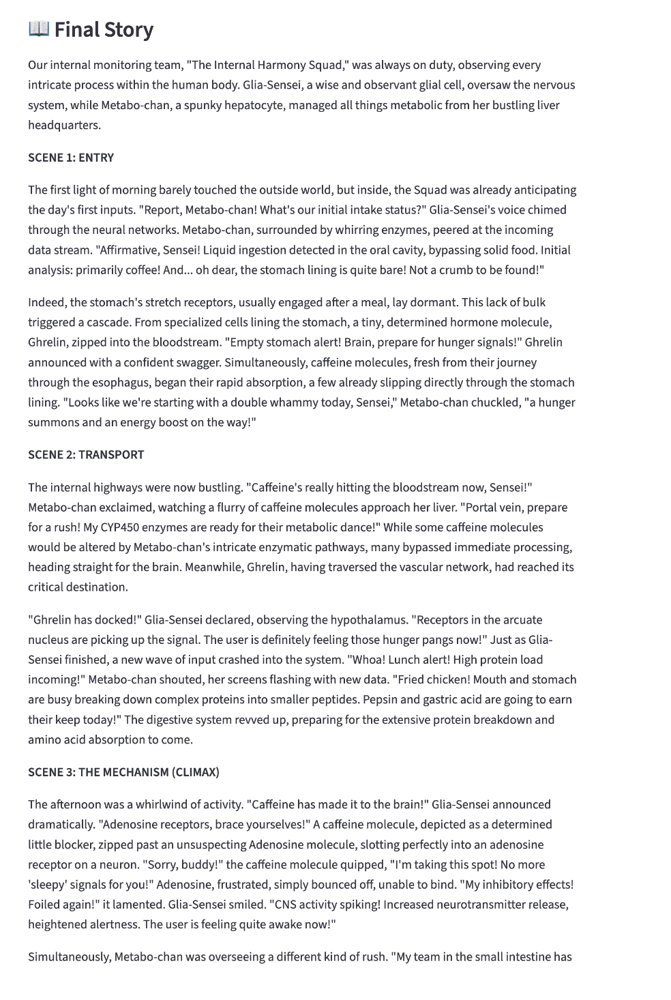
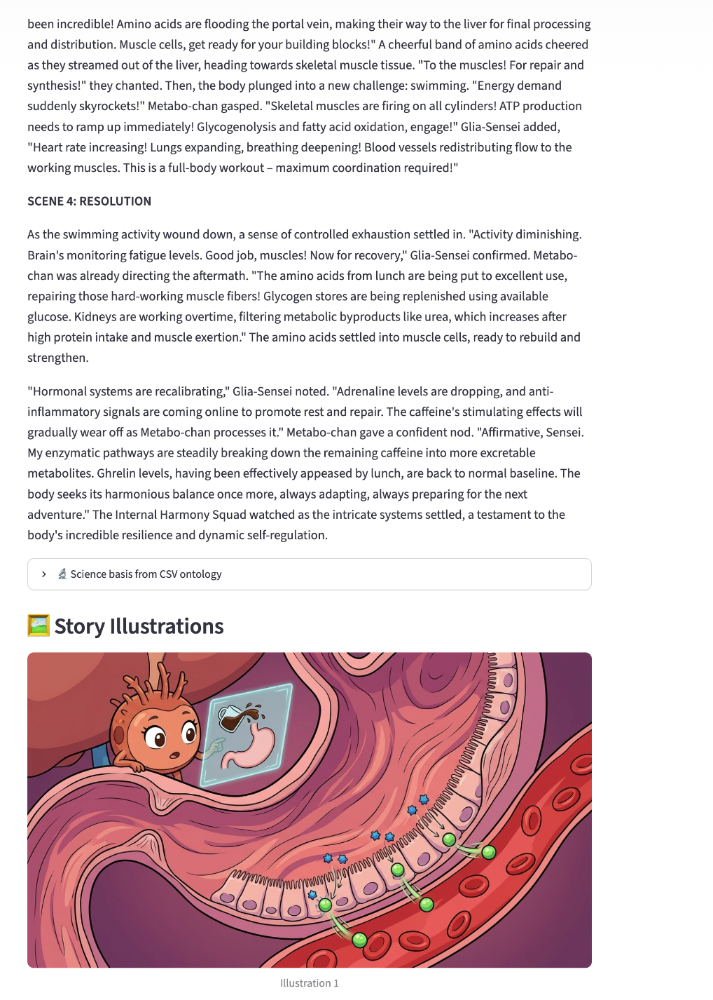
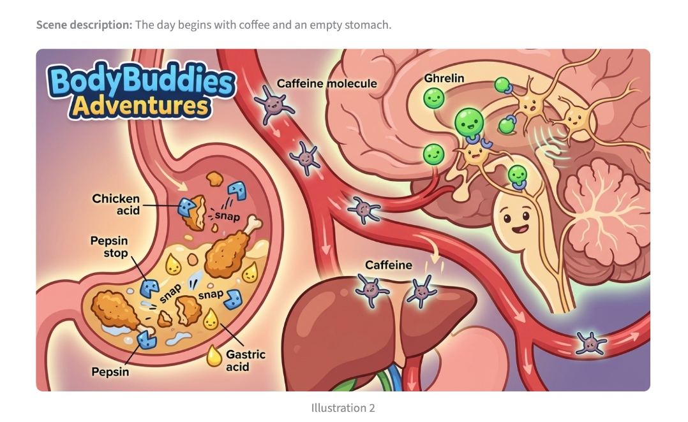

# BodyBuddies Adventures

BodyBuddies Adventures turns everyday activities into illustrated, science-grounded
stories about what happens inside the human body.

The demo combines a lightweight CSV physiology ontology with Gemini. It retrieves
relevant multi-organ mechanisms first, then uses those mechanisms as the scientific
backbone for a four-scene story. Users can generate text only or request one to four
illustrations.

## Live Demo

### [Open BodyBuddies Adventures](https://bodybuddies-adventure.streamlit.app/)

No installation or API key is required. Open the link, describe an everyday
activity, choose whether to include illustrations, and generate the body adventure
directly in the browser.

> Educational demo only. The generated content is not medical advice, diagnosis,
> or treatment guidance.

## Demo Experience

### 1. Describe an everyday activity

Example:

> This morning I drank coffee on an empty stomach, had fried chicken for lunch,
> and went swimming in the afternoon.

Before generating, the user chooses:

- **Story only** for a faster, lower-cost response.
- **Story + illustrations** with a slider for one to four images.

### 2. Follow the internal body adventure

Every story follows the same four-scene structure:

| Scene | Story role |
| --- | --- |
| **Scene 1: Entry** | The activity, food, or molecule enters the body. |
| **Scene 2: Transport** | Organs, blood, cells, or signaling systems respond. |
| **Scene 3: The Mechanism** | The central physiological mechanism becomes the climax. |
| **Scene 4: Resolution** | The body adapts, restores balance, or completes the response. |

### 3. See the science behind the story

The app displays the matched CSV ontology pathway alongside the final story. This
makes it clear which organs and mechanisms grounded the generated narrative.

## Project Documentation

See [PROJECT_STRUCTURE.md](PROJECT_STRUCTURE.md) for:

- Repository structure and component responsibilities.
- Ontology retrieval and Gemini request flow.
- Environment variables and deployment configuration.
- Public-demo limitations and security considerations.

## Core Files

| File | Purpose |
| --- | --- |
| `app.py` | Streamlit UI, ontology retrieval, story generation, and illustrations. |
| `data/ontology_multi_organ_steps.csv` | Lightweight multi-organ physiology ontology. |
| `requirements.txt` | Minimal Python dependencies. |
| `.env.example` | Local server-side configuration template. |
| `.streamlit/secrets.toml.example` | Streamlit deployment secret template. |

## License and Data Use

This repository currently does not include an explicit open-source license.
Contact the project owner before redistributing the code or ontology data.

## Demo Screenshots

### 1. Activity Input and Illustration Settings

  

### 2. Generated Story

  

### 3. Story Resolution and First Illustration

  

### 4. Additional Story Illustration

  

